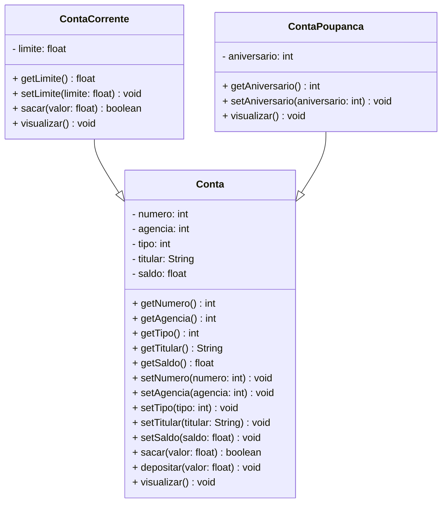

# Projeto Conta Bancária - Java


[](https://camo.githubusercontent.com/30a9cb9769ce5f1481af69d25d347bd70d63476712ec90d23404b47c4891ecda/68747470733a2f2f692e696d6775722e636f6d2f496144346c77672e706e67)


      

------


## 1. Descrição

O **Projeto Conta Bancária** é um sistema de gestão projetado para simular e administrar operações financeiras relacionadas a contas bancárias. Oferece funcionalidades como **cadastro**, **consulta**, **atualização** e **remoção** de contas, além de transações como depósitos, saques e transferências.

O sistema organiza as informações dos clientes — incluindo nome do titular, número da conta, saldo e tipo de conta — garantindo a realização segura das operações. Seu principal objetivo é automatizar e simplificar o gerenciamento de contas bancárias, como Conta Corrente e Conta Poupança, promovendo agilidade e precisão no controle financeiro.

Este projeto, desenvolvido em **Java**, foca no estudo e aplicação dos conceitos de **Programação Orientada a Objetos (POO)**, incluindo:

- Classes e Objetos;
- Atributos e Métodos;
- Modificadores de Acesso;
- Herança e Polimorfismo;
- Classes Abstratas;
- Interfaces.

Além de servir como um simulador funcional, o projeto oferece uma base prática para compreender os princípios fundamentais da POO aplicados a um cenário realista.


## 2. Funcionalidades do Projeto

1. **Criar Conta:** Cria uma nova conta bancária especificando nome do titular, número da agência, saldo inicial e propriedades específicas conforme o tipo da conta. O número da conta é gerado automaticamente.

2. **Listar todas as Contas:** Lista todas as contas cadastradas no sistema.

3. **Consultar uma Conta pelo número:** Encontra uma conta pelo número.

4. **Consultar uma Conta pelo titular:** Encontra uma ou mais contas associadas ao nome do titular.

5. **Editar Conta:** Permite atualizar os dados de uma conta existente a partir do número da conta.

6. **Excluir Conta:** Remove uma conta específica com base no número da conta.

7. **Sacar:** Realiza a retirada de um valor de uma conta, desde que o saldo seja suficiente.

8. **Depositar:** Adiciona um valor ao saldo de uma conta existente.

9. **Transferir:** Transfere um valor de uma conta para outra, respeitando os respectivos saldos e limites.

   

## 3. Diagrama de Classes

Um **Diagrama de Classes** é um modelo visual usado na programação orientada a objetos para representar a estrutura de um sistema. Ele exibe classes, atributos, métodos e os relacionamentos entre elas, como associações, heranças e dependências.

Esse diagrama ajuda a planejar e entender a arquitetura do sistema, mostrando como os componentes interagem e se conectam. É amplamente utilizado nas fases de design e documentação de projetos.

Abaixo, você confere o Diagrama de Classes do Projeto Conta Bancária:





## 4. Tela Inicial do Sistema - Menu


[](https://camo.githubusercontent.com/0c1b34a65f6d4e29ef5ba6d8e728d0e917cfd56fe0e450e6e166b927ddab11bc/68747470733a2f2f692e696d6775722e636f6d2f4d464b397958422e706e67)


## 5. Requisitos

Para executar os códigos localmente, você precisará de:

- [Java JDK 17+](https://www.oracle.com/java/technologies/javase/jdk17-archive-downloads.html)

- [Eclipse](https://eclipseide.org/) ou [STS](https://spring.io/tools)

  

## 6. Como Executar o projeto no Eclipse/STS


### 6.1. Importando o Projeto


1. Clone o repositório do Projeto [Conta Bancária](https://github.com/lefcc/conta_bancaria.git) dentro da pasta do *Workspace* do STS/Eclipse

```
git clone https://github.com/lefcc/conta_bancaria.git
```

1. **Abra o Eclipse/STS** e selecione a pasta do *Workspace* onde você clonou o repositório do projeto
2. No menu superior do Eclipse/STS, clique na opção: **File 🡲 Import...**
3. Na janela **Import**, selecione a opção: **General 🡲 Existing Projects into Workspace** e clique no botão **Next**
4. Na janela **Import Projects**, no item **Select root directory**, clique no botão **Browse...** e selecione a pasta do Workspace onde você clonou o repositório do projeto
5. O Eclipse/STS reconhecerá automaticamente o projeto
6. Marque o Projeto Conta Bancária no item **Projects** e clique no botão **Finish** para concluir a importação

### 6.2. Executando o projeto


1. Na guia **Package Explorer**, localize o Projeto Conta Bancária

2. Abra a **Classe Menu**

3. Clique no botão *Run*  para executar a aplicação

4. Caso seja perguntado qual é o tipo do projeto, selecione a opção **Java Application**

5. O console exibirá o menu do Projeto.

   

## 7. Contribuição

Este repositório é parte de um projeto educacional, mas contribuições são sempre bem-vindas! Caso tenha sugestões, correções ou melhorias, fique à vontade para:

- Criar uma **issue**

- Enviar um **pull request**

- Compartilhar com colegas que estejam aprendendo Java!

  

## 8. Contato

Desenvolvido por [**Letícia**](https://github.com/lefcc) Para dúvidas, sugestões ou colaborações, entre em contato via GitHub ou abra uma issue!